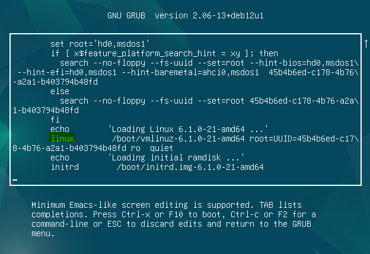
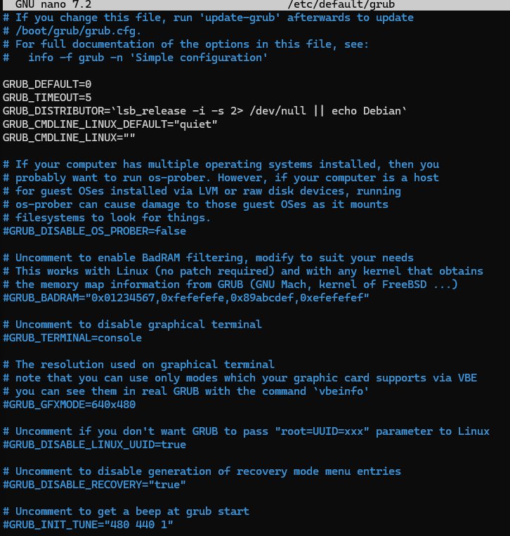
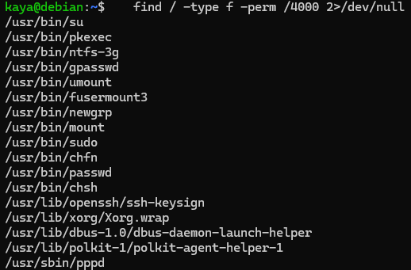
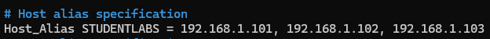
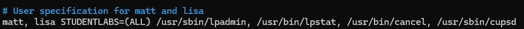
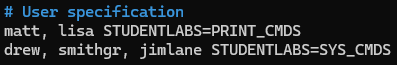
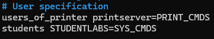

# Содержание
1. [Глава 1. С чего начать](#title_1)
2. [Глава 2. Загрузка и системные демоны](#title_2)
3. [Глава 3. Управление доступом и привилегии суперпользователя](#title_3)

## Легенда
Для удобства напротив каждого вопроса обозначила статусы выполнения заданий:
| STATUS ✅ - считаю задание решенным
| STATUS ⏯ - задание в процессе, еще не готово
| STATUS ⛔️ - пока не могу решить это задание 

Также из книги перенесла обозначение сложности задач:
⭐
⭐⭐
⭐⭐⭐

## <a id="title_1">Глава 1. С чего начать</a>
> Вопросы взяты из аналогичной книги, 4-ое издание. Глава почти идентична

### Вопрос 1 | STATUS ✅
Какую команду нужно ввести, чтобы получить информацию о драйвере терминала tty (а не о команде tty)? Как прочитать соответствующую страницу документации, хранящуюся в каталоге /usr/local/share/man? 

### Ответ 1
Сперва вводим в терминал `man man` – чтобы узнать точную структуру man-страниц в данном дистрибутиве. У меня так:


Раздел 4 указан как Specially files (usually found in /dev), я так поняла, что нужен он, согласно концепции, что всё есть файл.

**Команда, чтобы получить информацию о драйвере терминала tty (а не о команде tty):**
```
man 4 tty
```

Для поиска страницы документации по определенному пути нужно либо загуглить, либо почитать доку:


**Команда (любая на выбор) для поиска доки в /usr/local/share/man:**
```
man -M /usr/local/share/man 4 tty
man –manpath = /usr/local/share/man 4 tty
```

### Вопрос 2 | STATUS ✅
Определяет ли общий конфигурационный файл поведение команды man в вашей системе? Какие строки нужно в него добавить, чтобы локальные материалы хранились в каталоге /doc/man? Как организовать каталог /doc/man, чтобы его структура соответствовала иерархии справочных страниц? 

### Ответ 2 
Видимо, вопрос с подвохом. Я поняла так:
- В Linux нет понятия общего конфигурационного файла, а частные файлы конфигурации хранятся в `/etc`. 
- Для manpath есть свой конфигурационный файл — `/etc/manpath.config`

**По итогу `/etc/manpath.config` определяет поведение команды man, т.к. он говорит команде в каких каталогах искать файлы для чтения**

Был вопрос. Что имеется в виду под локальными материалами, и почему нельзя их хранить вместе со стандартной документацией. Для себя решила так, что локальные материалы могут относиться к собственным скриптам и ПО, и документацию по ним лучше хранить отдельно по причинам:
- При отдельном хранении локальных материалов у нас будет более корректная структура — системное vs наше:
  - У man есть станадартные каталоги поиска и у них есть стандартное содержание, если туда класть свое, то можно случайно подпортить системную документацию, поэтому стоит разграничивать
  - Так удобнее вести изменения в локальных материалах

**По добавлению строк**
Открываем конфиг для внесения изменений:
```
sudo nano /etc/manpath.config
```

Нашла два варианта:
1. Добавить строку `MANDATORY_MANPATH /doc/man` — я так понимаю, если мы добавляем общую документацию, то можем прописать путь тут. Т.е. НЕ под конкретную программу можем такой способ использовать
   - Единственное, я не придумала примеры такой документации

2. Прописать маппинг по типу:
`MANPATH_MAP /путь_к_конкретной_программе /путь_к_локальной_документации_этой_программы` – это, как я понимаю, можем использовать при добавлении доки под конкретные программы

> **Вопросы, которые остались:**
- Все же, что такое локальные материалы?
- Где корректнее хранить локальные материалы на практике?
- Как корректнее прописывать путь к локальным материалам?

### Вопрос 3 | STATUS ✅
Как в настоящее время протекает разработка ядра Linux? Каковы наиболее актуальные вопросы? Какие организации играют в этом процессе ключевую роль? Кто руководит проектом? 

### Ответ 3
#### Процесс разработки ядра
Главная фигура — Линус Торвальдс, как основатель и главный координатор проекта ядра Linux.

Разработка ядра Linux — это децентрализованный и коллективный процесс. По сути изменения может предложить любой разработчик.
Сам процесс:
1. **Предложение изменений**
   Разрабочик клонирует к себе репозиторий Git, создает свою ветку и прописавает свои предложения по изменению ядра. 

2. **Отправка патчей**
   Далее предложения отправляются на рассмотрение по схеме, схожей с Pull Request, но немного отличающейся: вместо отправки Pull Request на платформу вроде GitHub, в случае с ядром Linux разработчики обычно отправляют патчи через почтовые списки (например, LKML - Linux Kernel Mailing List). Патчи должны соответствовать определенным стандартам и форматам. 

3. **Рассмотрение изменений**
   Патчи рассматриваются мэйнтейнерами соответствующих подсистем. Это группа опытных разработчиков, которые контролируют определенную область кода ядра (например, файловую систему, сетевой стек и т.д.).
   Мэйнтейнеры проверяют изменения, могут запрашивать доработки, проводить тестирование и в конечном итоге решают, принять ли изменения в соответствующую ветку.

4. **Интеграция в upstream**
  Если мейнтейнер одобряет патч, он добавляет его в свою ветку. Оттуда патч может быть передан Линусу Торвальдсу или другому высокопоставленному мэйнтейнеру для интеграции в основную ветку ядра (mainline).

#### Ветки разработки
- **Prepatch** (или -rc, release candidate): Эта ветка предназначена для выпуска кандидатов в релиз перед выпуском новой основной версии ядра. Когда новая основная версия ядра готовится к выпуску, изменения интегрируются в prepatch-ветку для обширного тестирования и отладки. В этом состоянии ядро помечается меткой -rc (например, 6.0-rc1, 6.0-rc2 и т.д.). Ветки prepatch выпускаются на регулярной основе, позволяя сообществу тестировать последние изменения и сообщать о багах, которые должны быть исправлены перед окончательным релизом. Когда новый релиз-кандидат считается достаточно стабильным, он становится новой основной версией ядра (mainline). Этот процесс продолжается до тех пор, пока Линус Торвальдс не решит, что ядро готово для окончательного выпуска.
- **Vanilla/Mainline**: Основная ветвь разработки, поддерживаемая Линусом Торвальдсом. Новые изменения и функции вводятся в эту ветвь. Новые основные ядра выпускаются каждые 9-10 недель.
- **Stable**: После того как изменения будут интегрированы и протестированы в mainline, они могут быть перенесены в стабильные ветки, которыми занимаются мейнтейнеры, такие как Грег Кроа-Хартман.
- **Longterm**: Долгосрочные стабильные версии, обычно поддерживаемые в течение нескольких лет для крупными версиями ядра, важными для корпоративных и встроенных систем.

#### Ключевые вопросы
Ключевые вопросы в разработке ядра Linux, на мой взгляд:
- Безопасность и стабильность работы (закрытие действующих и потенциальных уязвимостей)
- Соответствие стандартным современных технологий (железо / ПО)
- Обратная совместимость (поддержка старых функций / старого железа, которое еще актуально)
- Производительность (оптимизация работы на разных устройствах)
- Масштабируемость (возможность справляться с увеличением нагрузки)
- Развитие (новая функциональность, не фичи, а именно базовые аспекты)

#### Организации, которые играют ключевую роль в разработке ядра
Организации, которые играют ключевую роль, на мой взгляд такие:
- Linux Foundation ( LF ) — некоммерческая организация, созданная в 2000 году для поддержки разработки Linux и проектов программного обеспечения с открытым исходным кодом.
- Спонсоры свободных дистрибутивов
- Коммерческие организации, выпускающие собственные дистрибутивы (по типу Red Hat, SUSE)
- Произвоители железа, которые заинтересованы в том, чтобы оно в том числе классно работало и с Linux 

### Вопрос 4 ⭐ | STATUS ✅
Изучите возможности нескольких систем UNIX и Linux и порекомендуйте операционную систему для каждого из перечисленных ниже случаев. Аргументируйте свой выбор. 
- домашний компьютер пользователя
- университетская компьютерная лаборатория 
- корпоративный веб-сервер 
- серверный кластер, обеспечивающий работу базы данных для судоходной компании 

### Ответ 4
Мне было легко ответить на вопрос про домашний компьютер пользователя. Про корпоративный веб-сервер частично сама ответила, частично искала. При ответе на часть про университетские лаборатории, я решила, что лаборатории могут подразумевать слабые ПК, и ответила, какие, на мой взгляд дистрибутивы могут подойти в этом случае. 
И пришлось хорошо поискать про то, какие дистры удобные при решении научно-исследовательских задач, и какие подойдут для серверного кластера.

Для лучшего понимания, и поискала требования к ОС, в зависимости от возможног оварианта использования. Решила выписать в том числе как подзсказку себе на будущее.

#### Требования к ОС в зависимости от случаев использования
1. **Домашний компьютер пользователя**:
   - Удобство использования: Интерфейс должен быть интуитивно понятным.
   - Поддержка мультимедиа и игр: Широкий выбор программ для работы с мультимедиа и играми.
   - Сообщество: Широкая поддержка сообществом, наличие формов и документов.

2. **Университетская компьютерная лаборатория**:
   - Надежность и стабильность: Лёгкость в администрировании и усовершенствованная безопасность.
   - Хорошая поддержка сети и периферийных устройств: Поддержка широкого спектра оборудования и периферийных устройств.
   - Удаленное управление: Возможность удаленного администрирования и обновления.

3. **Корпоративный веб-сервер**:
   - Безопасность: Поддержка передовых механизмов защиты и быстрого получения обновлений безопасности.
   - Производительность: Важно для обеспечения высокой скорости ответа и обработки запросов.
   - Стабильность и долгий цикл поддержки: Надежная и проверенная система, совместимая с основными веб-технологиями.

4. **Серверный кластер (например, обеспечивающий работу базы данных для судоходной компании)**:
   - Высокая доступность (High Availability): Поддержка систем кластеризации и балансировки нагрузки.
   - Масштабируемость: Способность эффективно работать с увеличением нагрузки и объёмов данных.
   - Производительность и оптимизация хранения данных: Особое внимание к производительности ввода-вывода и оптимизации базы данных.
  
#### Конкретные ОС под примеры использования
- **домашний компьютер пользователя**
  - **Linux-системы**: Ubuntu Desktop, Linux Mint. Причины: простота использования, удобный интерфейс, большое сообщество пользователей (а значит и ответы на самые частые проблемы), а в случае mint еще и не требовательность к железу
  - **Unix-системы**: MacOS. Причины удобный интерфейс, плюс система давно зарекомендовала себя как надежная и удобная, имеет группу поклонников, которым она подойдет

- **университетская компьютерная лаборатория** 
  > Считаю, что тут нужно уточнение, какого типа лаборатория. 
  - **Linux-системы**: 
    - Lubuntu, Xubuntu, Linux Mint — простые и удобные в интерфейсе + рассчитаны на слабые ПК, что, на мой взгляд актуально для университетских компьютерных лабораторий
    - Debian — в интернете указано, что дистрибутив подходит для серверных задач, а также для научных и исследовательских задач. Также пишут, что он широко используется в образовательных учреждениях благодаря своей надежности и открытой архитектуре
  - **Unix-системы**:
    - NetBSD — если наша задача — иметь систему для нихкоресурсных компьютеров
    - Solaris (OpenSolaris/Illumos) — в интернете указано, что дистрибутив подходит для серверных задач, а также для научных и исследовательских задач

- **корпоративный веб-сервер** 
  - **Linux-системы**: 
    - RHEL — известный дистрибутив под эти задачи, стабильный, гибкий, с большой поддержкой, но платный 
    - CentOS Stream — в теории можно, но не нужно. Пишут, что CentOS эволюционировал в CentOS Stream, а он в своб очередь не подошел разработчикам разного ПО и потерял свою популярность. Ограниченная доступность пакетов. 
    - Rocky Linux — в интернете указано, что дистрибутив создан как преемник CentO (также на базе RedHat Enterprise Linux) и в основном используется для серверных и корпоративных решений. Но может быть не так оптимизирован, как RHEL
    - AlmaLinux — в интернете указано, что дистрибутив, продолжает развитие CentOS (альтернатива CentOS)
    - Ubuntu Server — общирная документация, большое количество пакетов, но может быть ресурсозатратной
    - SUSE Linux Enterprise Server (SLES) – это масштабируемая, высокопроизводительная операционная система корпоративного уровня для безопасных вычислений
    - еще можно Debian, но вроде как не рекомендуют, т.к. пакеты часто отстают на несколько месяцев от исходного потока. Исправления безопасности для ядра могут отсутствовать
    - и то же с Fedora Server — пишут, что можно, но может быть не таким стабильным + придется чаще обновляться по сравнению с более консервативными дистрибутивами
  - **Unix-системы**
    - FreeBSD — отличается нажежностью, гибкостью, высокой стабильностью

- **серверный кластер, обеспечивающий работу базы данных для судоходной компании**- не знаю (пока что)
  - **Linux-системы**:
    - RHEL — высокая доступность и отказоустойчивость (есть встроенные инструменты для управления клонами и восстановления), производительность (оптимизирован для больших нагрузок и объемов данных), поддержка от Red Hat, в том числе для кластерных решений
    - CentOS Stream — как и выше — в теории можно, но не нужно.
    - Rocky Linux — в интернете указано, что у дистрибутива также есть поддержка кластеров
    - SUSE Linux Enterprise Server (SLES) – это масштабируемая, высокопроизводительная операционная система корпоративного уровня для безопасных вычислений
  - **Unix-системы**:
    - FreeBSD — пишут что хорошо подойдет для систем с высокими требованиями к производительности и надежности; что платформа хорошо оптимизирована для сетевых и серверных задач, а также есть поддержка кластеров (Много свободных инструментов для создания и управления кластерами)

### Вопрос 5 ⭐ | STATUS ✅
Предположим, вы обнаружили, что определенное свойство демона httpd сервера Apache работает не так, как описано в документации к Ubuntu. 
1. что нужно сделать перед тем, как сообщать об ошибке?
2. если вы решили, что это действительно ошибка, то кого нужно уведомить и каким способом?
3. какую информацию необходимо включить в отчет об ошибке? 

### Ответ 5
#### Порядок действий
Порядок действий считаю таким:
1. Проверить, что проблема не на нашей стороне: 
   - проверить состояние процессов Apache в системе с помощью менеджера сервисов systemd
   - проверить логи systemd для Apache, с помощью команды journalctl. В логах systemd для Apache, скорее всего, будут данные о проблемах с запуском или управлением процессом Apache 
   - проверить конфигурацию Apache с помощью команды apachectl configtest. Инструмент проанализирует файлы Apache и обнаружит все ошибки или недостающие настройки перед попыткой запуска сервера
   - проверить логи Apache с помощью инструмента tail или less
     - На сервере Fedora, CentOS или RedHat, изучите файл /var/log/httpd/error_log
     - На Debian или Ubuntu, проверьте /var/log/apache2/error.log с помощью инструмента tail или less.
        > Как правило, каждая ошибка, возникающая в браузере или другом HTTP-клиенте, создает соответствующую запись в логах Apache. Иногда Apache также выводит в свои логи ошибки, связанные с конфигурацией, встроенными модулями и другой отладочной информацией.)
   - проверить официальный FAQ / базу данных ошибок Apache / поискать ответ в их [базе знаний](https://cwiki.apache.org/confluence/display/httpd/FAQ#FAQ-WhomdoIcontactforsupport?);
   - проверить, что ошибка существует в самой последней версии Apache;
   - поискать в интернете похожие инциденты; 
   - по возможности воспроизвести ошибку на другой системе (может быть, на тестовом окружении);
   - обсудить с командой 
   - если проблема связана со сбоем сервера и созданием дампа ядра, то по возможности надо включить backtrace. Как пример:
        ```
        # cd ServerRoot
        # dbx httpd core
        (dbx) where
        ```

2. Отправить отчет об ошибке в Ubuntu — нажать Alt+F2 и ввести ubuntu-bug <имя пакета>. [Тут подробнее](https://help.ubuntu.com/stable/ubuntu-help/report-ubuntu-bug.html.ru)
3. Отправить отчет об ошибке в базу данных ошибок Apache:
   - инструкция к ознакомлению перед отправкой - https://httpd.apache.org/bug_report.html
   - сама базад данных ошибок Apache - https://bz.apache.org/bugzilla/ 

#### Содержание отчета об ошибке
В отчет об ошибке необходимо внести:
- компонент (часть продукта, на которую влияет обнаруженная ошибка; если неизвестно, то выбрать «Общие»), 
- версию используемой программы, 
- ОС и платформа, на которой работает программа 
- критичность  ошибки 
- краткое, но точное описание обнаруженной ошибки:
  - что должно было произойти
  - что произошло в действительности
  - какие действия привели к ошибке (по возможности минимальный ряд шагов, где первый шаг — запуск программы)

### Вопрос 6 ⭐⭐ | STATUS ✅
Системы Linux серьезно заявили о себе в производственных средах. Обречены ли UNIX-системы? Почему?

### Ответ 6
В Википедии пишут так: «В настоящий момент GNU/Linux и представители семейства BSD быстро отвоёвывают рынок у коммерческих Unix-систем и одновременно проникают как на настольные компьютеры конечных пользователей, так и на мобильные и встраиваемые системы.». Мне кажется, что еще в течение долгого времени UNIX-системы не будут обречены, хотя могут стать менее популярнымы. 

Причины:
- Во-первых, MacOS является UNIX-подобной системой, а она сейчас плотно находится на рынке и навряд ли будет уходить
- Во-вторых, я думаю, что за это время уже есть приличное количество компаний, используют UNIX-подобные системы, и которым дороже будет переходить на другие ОС, чем поддерживать существующую
- В-третьих, вероятно, крупные компании могут предпочесть определенные дистрибутивы UNIX-подобных систем для своих целей

## <a id="title_2">Глава 2. Загрузка и системные демоны</a>
> Вопросы взяты из аналогичной книги, 4-ое издание. Глава отличается по расположению и содержанию

### Вопрос 1 | STATUS ✅
Можно ли UNIX- или Linux-системы выключать нажатием кнопки питания на корпусе компьютера? А что скажете насчет выключения вилки компьютера из розетки на стене? Поясните свой ответ. Постарайтесь определить вероятность получения отрицательного ответа на поставленные вопросы с помощью Интернета.

### Ответ 1 
Мое личное мнение, что можно в плане того, что ничего супер страшного не случится, компьютер не сломается. Но, насколько я помню, если процессы некорректно завершить (с помощью kill, к примеру), то потом могут возникнуть проблемы. Поэтому с точки зрения "можно ли так поступать целенаправленно?" ответ — нет. На мой взгляд, в интернете ответ будет отрицательным 100%. Но пойду проверю.

Проверила:
1. Первый ответ в выдаче:


2. На [opennet.ru](https://www.opennet.ru/docs/RUS/debian_install/ch08s01.html) пишут, что крайне не рекомендуется таким способом выключать ОС, потому что можно потерять файлы и/или повредить жесткий диск.

3. Хотя я вот узнала, что выключение по кнопке не такое критичное, как выдергивание шнура из розетки, потому что ACPI позволяет ОС корректно управлять процессом выключения компьютера при нажатии кнопки питания. Работает так:
   * Пользователь нажимает кнопку выключения компьютера
   * ACPI отправляет сигнал операционной системе, что начинается процесс выключения. 
   * Операционная система тогда завершает все активные процессы, сохраняет данные на диске и корректно завершает работу, прежде чем полностью отключить компьютер. 

   Еще я узнала, что иногда нам может потребоваться отключить ACPI, например, при аварийной загрузке, чтобы убедиться, что проблема с запуском не связана с ACPI. И так как ACPI может оказаться выключенным, то лучше все-таки компьютер по кнопке не выключать

### Вопрос 2 | STATUS ✅
Используйте опции командной строки загрузчика GRUB для загрузки ядра, информация о котором отсутствует в файле grub.conf.
### Ответ 2
Как я поняла, в вопросе необходимо единоразово загрузиться с другого ядра, так как если мы хотим это сделать на постоянной основе, то нам просто необходимо добавить инфу о ядре в `grub.conf`. 
Если же мы хотим разово выбрать какое-то другое ядро, то для этого надо пойти по шагам ниже.

#### Для единоразового изменения: 
1. Зайти в меню grub - запустить / перезапустить систему и нажать F2 (иногда Esc, Shift, зависит от конфига)
2. Нажать **e**, чтобы отредактировать текущий target загрузки 
3. Далее находим строку, которая начинается с linux:
    
   
   > И указываем нужный путь к ядру, например: `linux /boot/vmlinuz-<version> root=/dev/sda1 ro quiet splash`, где
     - /boot/vmlinuz-<version> — путь к ядру.
     - root=/dev/sda1 — указание корневого раздела.
     - ro quiet splash — дополнительные опции (например, режим только для чтения, тихий режим, графическая загрузка).
 
4. Загружаемся с измененными параметрами, для этого зажимаем Ctrl + X  (где-то может быть F10)

Как доп. инфо решила добавить и про постоянное изменение ядра загрузки.

#### Для изменения на постоянной основе (изменения конфига grub):
1. Во-первых, нужно убедиться, что ядро установлено в системе
   1.1. Нужно проверить, что новое ядро (например, `vmlinuz-4.x.x`) и соответствующие `initrd`-файлы (`initrd.img-4.x.x`) находятся в `/boot`. Сделать это можно с помощью команды:
   ```console
   ls /boot
   ```
   * Если нужного ядра там нет, то нужно скопировать установочный файл ядра и `initrd` в `/boot`

2. Далее нужно добавить новое ядро в конфигурацию GRUB вручную.
   2.1. Для этого нужно открыть на редактирование файл `/etc/default/grub`:
  ```console
  sudo nano /etc/default/grub
  ```
  

  2.2. Находим строку:
  ```console
  GRUB_DEFAULT=0
  ```
   > Значение `GRUB_DEFAULT` - это номер пункта в меню загрузки, который должен быть выбран стандартным (нумерация начинается с нуля) значение по умолчанию - `0`. Здесь нужно изменить `0` на номер строки, на которой расположено новое ядро (отсчет по-прежнему с нуля). Например, если новое ядро находится на второй строке в списке GRUB, мы пишем `1`.
3. Затем нужно обновить конфигурацию GRUB с помощью команды:
   ```console
   sudo update-grub
   ```
* После чего нужно перезагрузить систему, чтобы изменения вступили в силу:
  ```console
   sudo reboot
   ```
   После перезагрузки система загрузится с новым ядром, если его указали как новое по умолчанию.
И тогда информация о ядре уже будет в файле grub.conf.
> Примечание конфиг grub в зависимости от системы находится либо в /boot/grub/, либо в /boot/grub2/. Но он генерируется из скриптов и файлов конфигурации, включая /etc/default/grub и файлы в /etc/grub.d/. Поэтому напрямую в него мы можем не лезть. 


### Вопрос 3 ⭐ | STATUS ✅
Объясните концепцию уровней выполнения. Перечислите уровни выполнения, существующие в одной из ваших локальных систем, и кратко опишите каждый из
них. Чем отличаются концепции уровней выполнения в Ubuntu и других дистрибутивах Linux?

### Ответ 3 
Концепция уровней выполнения актуальна для традиционных систем инициализации, основанных на демоне init. Уровни выполнения — это режимы работы ОС (не ядра), которые определяют, какие сервисы должны быть запущены при запуске ОС. Сервисы и их количество будет отличаться на разных уровнях в зависимости от поставленной задачи. Самое понятное, на мой взгляд, объяснение — это разница между однопользовательским режимом, в котором есть необходимый минимум для восставноления ОС и между многопользовательским графическим режимом, в котором пользователь может спокойно пользоваться системой и запускать нужные программы.

Основные runlevel (тут я все по памяти не вспомнила, погуглила):
* Runlevel 0: Выключение системы.
* Runlevel 1: Однопользовательский режим (аварийный режим). 
* Runlevel 2: Многопользовательский режим без сетевых сервисов. 
* Runlevel 3: Полный многопользовательский режим с сетевыми сервисами. 
* Runlevel 4: Не используется (зарезервирован для пользовательских настроек). 
* Runlevel 5: Графический режим. 
* Runlevel 6: Перезагрузка системы.

Конкрентная реализация Runlevel2-5 будет различаться в зависимости от дистрибутива набором старутющих сервисов.

> Команда `runlevel` позволяет определить текущий уровень выполнения

В systemd, которая пришла на смену init, уровни выполнения были заменены на цели запуска (target), среди которых есть 3 основных:
* многопользовательский графический — default.target
* многопользовательский текстовый — multi-user.target
* однопользовательский - авариайный — rescue.target

> Команда `systemctl get-default` позволяет определить текущий target. 
> При этом в systemd команда `runlevel` тоже будет работать и выведет уровень выполнения. Это происходит потому что в systemd есть обратная совместимость с традиционными концепциями через использование alias и совместимости команд. 

Я думаю, что в вопросе про отличие Ubuntu от других дистрибутивах имеется в виду, что в Ubuntu по умолчанию используется systemd, который является как раз уже другой концепцией. Хотя в интернет говорит, что systemd — современная система инициализации, поэтому я думаю, что он есть не только в Ubuntu.

### Вопрос 4 ⭐ | STATUS ⛔️ 
Напишите сценарий, предназначенный для запуска некоего сетевого демона /usr/local/sbin/foo. Покажите, как организовать автоматический запуск сценария на этапе начальной загрузки системы.

### Ответ  
Я пока не знаю, как писать скрипты. Оставлю этот вопрос на будущее

### Вопрос 5 ⭐⭐⭐ | STATUS ✅
Если система находится на уровне выполнения 3 и вводится команда telinit 1, какие действия предпримет демон init? Каким будет конечный результат?

### Ответ  5
Runlevel 3 - полный многопользовательский режим с сетевыми сервисами. Runlevel 1 - однопользовательский режим (аварийный режим). Соответственно при смене режима с 3 на 1, демон init остановит все процессы пользователей, все включенные сетевые сервисы, перейдет в однопользовательский режим под пользователем root.

### Вопрос 6 ⭐⭐⭐ | STATUS ✅
Нарисуйте схему, показывающую очередность запуска демонов в вашей системе.

### Ответ 6
Я так поняла, что нужна такая схема. Или нет?


### Вопрос 7 ⭐⭐⭐ | STATUS ⛔️
Опишите последовательность действий, необходимых для инсталляции на одном компьютере операционных систем Linux и Windows. Используйте программу GRUB.
### Ответ  ЧЕРНОВИК


## <a id="title_3">Глава 3. Управление доступом и привилегии суперпользователя</a>
### Вопрос 1 | STATUS ✅
Воспользуйтесь командой find с флагом -perm, чтобы найти в своей системе пять файлов с установленным битом “setuid”. Объясните, почему каждая из команд не сможет правильно функционировать без этого бита.
### Ответ 
Итак, сперва про setuid:
SUID – это специальный атрибут, который можно установить на исполняемый файл в операционной системе Linux. Когда у файла установлен SUID, он выполняется от имени владельца файла, а не от имени текущего пользователя. Это позволяет обычным пользователям запускать определенные программы или команды с повышенными привилегиями, как будто они были запущены администратором системы.

Если вкратце, то я узнала, что во всех программах с атрибутом SUID важны еще два атрибута: EUID (Equivalent UID) используется для определения прав доступа к файлу (обычно в 0 для root) и RUID (Real UID) сохраняет настоящее значение UID (если пользователь имеет UID 1001, его RUID останется 1001). И именно они отвечают за разрешения, таким образом, тот же passwd позволяет нам менять свой пользовательский пароль, но не позволяет менять пароли других пользователей.

Я ввела команду `find /root -name "*.txt" 2>/dev/null` для поиска нужных файлов + добавила `2>/dev/null`, чтобы не отображать ошибки, получила такой вывод:

Вышел список исполняемых файлов, опишу, что нашла для первых пяти файлов (по заданию просили 5..):
* **Команда su** позволяет переключаться на другого пользователя в текущей командной оболочке. Это очень рисковое действие, если бы мы могли просто так переключаться на другого пользователя, зная его пароль, то мы могли бы как угодно сломать систему безо всяких следов. В общем, такое можно делать только с привелегиями суперпользователя, поэтому без "setuid" реализовать такое просто преступление.
* **Команда pkexec** позволяет выполнить одну команду с привилегиями root или другого пользователя без перехода в интерактивную сессию.
Тут аналогично, такую возможность нельзя давать всем пользователям системы. Только root, а без этого бита так не получится сделать.
  * На вопрос "А зачем тогда кому-то кроме рута этим пользоваться?" я так поняла, что в основном в целях помощи другим пользователям: иногда необходимо воспроизвести сценарий от их лица, чтобы найти проблему.
  
* **Команда ntfs-3g** используется для работы с файловыми системами NTFS. Думаю, это полезно администраторам системы, которым нужно как-то изменить монтирование системы в связи с новыми требованиями к задаче.
* **Команда gpasswd** позволяет управлять группами. Без бита "setuid" администратор не сможет изменить группы, в которые входит пользователь.
* **Команда umount** используется для размонтирования файловых систем. Тут я нашла, что такое полезно, если пользователь вставит флешку и захочет безопасно размонтировать ее перед извлечением, то ему понадобится эта команда. 

### Вопрос 2 | STATUS ✅
Создайте две записи в файле конфигурации sudoers.
а) первая запись разрешает пользователям matt и lisa конфигурировать принтер, очищать его очередь и перезапускать демоны печати на компьютере printserver
б) вторая запись позволяет пользователям drew, smithgr и jimlane удалять задания и перезагружать компьютеры в студенческой лаборатории
### Ответ 
Напрямую /etc/sudoers не рекомендуется редактировать, поэтотому я сделаю как рекомендуется, использую `sudo visudo`.

По заданию у нас указаны несколько компьютеров: 
* printserver
* компьютеры в студенческой лаборатории

С первым все понятно, со вторым не очень. По идее у нас эти компьютеры есть, допустим, они называются studentlab, и у нас их 3. Тогда перед выдачей прав мы должны их объединить в группу в этом же файле, есть два способа:
**Способ 1** (если у нас в DNS или /etc/hosts прописаны IP для этих имен компьютеров)
```console
Host_Alias STUDENTLABS = studentlab1, studentlab2, studentlab3
```

**Способ 2** (если у нас нет записи об этих компах)
```console
Host_Alias STUDENTLABS = 192.168.1.101, 192.168.1.102, 192.168.1.103
```
* Где `192.168.1.101, 192.168.1.102, 192.168.1.103` надо заменить на реальные IP
* 
 
Далее выдаю права на printserver:
```console
matt, lisa printserver= /usr/sbin/lpadmin, /usr/bin/lpstat, /usr/bin/cancel, /usr/sbin/cupsd
```

И выдаю права на компьютеры в студенческой лаборатории:
```console
drew, smithgr, jimlane STUDENTLABS= /usr/bin/rm -f **/path/to/tasks/***, /usr/bin/shutdown, /sbin/reboot
```
* Где /path/to/tasks/* надо заменить на путь до реальной директории с заданиями

Объяснение команд:
- Сперва пишем имена пользователей
- Потом к какому компьютеру / группе компьютеров применить правило
- Какие команды мы хотим разрешить
  - В случае с принтерами:
    - /usr/sbin/lpadmin - для настройки и управления принтерами 
    - /usr/bin/lpstat - для отображения статуса текущих запросов на печать, принтеров и систем печати
    - /usr/bin/cancel - для отмены одного или нескольких заданий на печать
    - /usr/sbin/cupsd - cupsd — это демон системы печати CUPS (Common UNIX Printing System). Запуск и остановка данного демона управляют всей подсистемой печати.
  - В случае со студенческими компами:
    - /usr/bin/rm -f **/path/to/tasks/*** - удаление директорий и файлов
    - /usr/bin/shutdown, /sbin/reboot - две команды для перезагрузки

Еще я подумала, что логичнее делать так:
* Во-первых, пользователей распределить по группам (пользователи принтера и студенты), 
* Во-вторых, распределять команды по типу сервера, чтобы проще искать. Нашла, что можно сами команды организовать вместе (по типу задач), например так:

 А потом вместо команд прописать алиасы, что визуально будет более понятно:
* Так:
  

* Или так:
  

### Вопрос 3 | STATUS ⛔️
Составьте три фразы по принципу “шокирующего абсурда”, а затем пропустите их ерез утилиту md5sum и сравните результаты. Не безопаснее ли использовать пароли в формате MD5 (учитывая достижения технологии шифрования)? Почему?
### Ответ  ЧЕРНОВИК

### Вопрос 4 ⭐ | STATUS ⏯
Опишите последовательность команд, позволяющих модифицировать чужой пароль, и покажите, как “замести следы”. Предполагается, что доступ к учетной записи root имеется только через утилиту sudo (разрешены все команды, кроме интерпретаторов и su).
### Ответ  ЧЕРНОВИК

### Вопрос 5 ⭐ | STATUS ⏯
Инсталлируйте утилиту sudo, которая будет направлять вам по электронной почте сообщения о попытках несанкционированного доступа. Используйте ее для проверки записей, созданных в упражнении 4.2, и убедитесь в том, что утилита правильно регистрирует сообщения в Syslog. (Необходим доступ с правами суперпользователя; возможно, понадобится также модифицировать файл /etc/syslog.conf.)
### Ответ  ЧЕРНОВИК

### Вопрос 6 ⭐ | STATUS ⛔️ 
В системе Solaris, HP-UX или AIX создайте RBAC-роль, которая бы позволяла монтировать и демонтировать файловые системы. Назначьте на эту роль двух пользователей. (Необходим доступ с правами суперпользователя.)
а) какие действия необходимо выполнить для этого? Можете ли вы ограничить список разрешенных операций для определенных файловых систем или типов файловых систем?
б) переопределите свое решение в виде sudo-конфигурации. Оно сложнее, чем RBAC-решение, или проще? Можете ли вы ограничить список разрешенных операций для определенных файловых систем или типов файловых систем?
### Ответ  ЧЕРНОВИК

## <a id="title_4">Глава 4. </a>