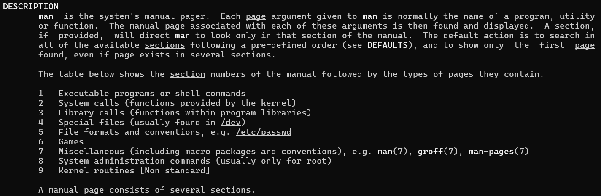
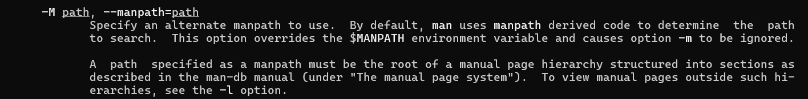

# Содержание
1. [Глава 1.15](#title_1)
2. [Глава ](#title_2)

## <a id="title_1">Глава 1.15.</a>
### Вопрос 1 
Какую команду нужно ввести, чтобы получить информацию о драйвере терминала tty (а не о команде tty)? Как прочитать соответствующую страницу документации, хранящуюся в каталоге /usr/local/share/man? 

### Ответ 1
Сперва вводим в терминал `man man` – чтобы узнать точную структуру man-страниц в данном дистрибутиве. У меня так:


Раздел 4 указан как Specially files (usually found in /dev), я так поняла, что нужен он, согласно концепции, что всё есть файл.

**Команда, чтобы получить информацию о драйвере терминала tty (а не о команде tty):**
```
man 4 tty
```

Для поиска страницы документации по определенному пути нужно либо загуглить, либо почитать доку:


**Команда (любая на выбор) для поиска доки в /usr/local/share/man:**
```
man -M /usr/local/share/man 4 tty
man –manpath = /usr/local/share/man 4 tty
```

### Вопрос 2
Определяет ли общий конфигурационный файл поведение команды man в вашей системе? Какие строки нужно в него добавить, чтобы локальные материалы хранились в каталоге /doc/man? Как организовать каталог /doc/man, чтобы его структура соответствовала иерархии справочных страниц? 

### Ответ 2 
Видимо, вопрос с подвохом. Я поняла так:
- В Linux нет понятия общего конфигурационного файла, а частные файлы конфигурации хранятся в `/etc`. 
- Для manpath есть свой конфигурационный файл — `/etc/manpath.config`

**По итогу `/etc/manpath.config` определяет поведение команды man, т.к. он говорит команде в каких каталогах искать файлы для чтения**

Был вопрос. Что имеется в виду под локальными материалами, и почему нельзя их хранить вместе со стандартной документацией. Для себя решила так, что локальные материалы могут относиться к собственным скриптам и ПО, и документацию по ним лучше хранить отдельно по причинам:
- При отдельном хранении локальных материалов у нас будет более корректная структура — системное vs наше:
  - У man есть станадартные каталоги поиска и у них есть стандартное содержание, если туда класть свое, то можно случайно подпортить системную документацию, поэтому стоит разграничивать
  - Так удобнее вести изменения в локальных материалах

**По добавлению строк**
Открываем конфиг для внесения изменений:
```
sudo nano /etc/manpath.config
```

Нашла два варианта:
1. Добавить строку `MANDATORY_MANPATH /doc/man` — я так понимаю, если мы добавляем общую документацию, то можем прописать путь тут. Т.е. НЕ под конкретную программу можем такой способ использовать
   - Единственное, я не придумала примеры такой документации

2. Прописать маппинг по типу:
`MANPATH_MAP /путь_к_конкретной_программе /путь_к_локальной_документации_этой_программы` – это, как я понимаю, можем использовать при добавлении доки под конкретные программы

> **Вопросы, которые остались:**
- Все же, что такое локальные материалы?
- Где корректнее хранить локальные материалы на практике?
- Как корректнее прописывать путь к локальным материалам?

### Вопрос 3
Как в настоящее время протекает разработка ядра Linux? Каковы наиболее актуальные вопросы? Какие организации играют в этом процессе ключевую роль? Кто руководит проектом? 

### Ответ 3
#### Процесс разработки ядра
Главная фигура — Линус Торвальдс, как основатель и главный координатор проекта ядра Linux.

Разработка ядра Linux — это децентрализованный и коллективный процесс. По сути изменения может предложить любой разработчик.
Сам процесс:
1. Предложение изменений. 
   Разрабочик клонирует к себе репозиторий Git, создает свою ветку и прописавает свои предложения по изменению ядра. 

2. Отправка патчей
   Далее предложения отправляются на рассмотрение по схеме, схожей с Pull Request, но немного отличающейся: вместо отправки Pull Request на платформу вроде GitHub, в случае с ядром Linux разработчики обычно отправляют патчи через почтовые списки (например, LKML - Linux Kernel Mailing List). Патчи должны соответствовать определенным стандартам и форматам. 

3. Рассмотрение изменений
   Патчи рассматриваются мэйнтейнерами соответствующих подсистем. Это группа опытных разработчиков, которые контролируют определенную область кода ядра (например, файловую систему, сетевой стек и т.д.).
   Мэйнтейнеры проверяют изменения, могут запрашивать доработки, проводить тестирование и в конечном итоге решают, принять ли изменения в соответствующую ветку.

4. Интеграция в upstream
  Если мейнтейнер одобряет патч, он добавляет его в свою ветку. Оттуда патч может быть передан Линусу Торвальдсу или другому высокопоставленному мэйнтейнеру для интеграции в основную ветку ядра (mainline).

#### Ветки разработки
- Prepatch (или -rc, release candidate): Эта ветка предназначена для выпуска кандидатов в релиз перед выпуском новой основной версии ядра. Когда новая основная версия ядра готовится к выпуску, изменения интегрируются в prepatch-ветку для обширного тестирования и отладки. В этом состоянии ядро помечается меткой -rc (например, 6.0-rc1, 6.0-rc2 и т.д.). Ветки prepatch выпускаются на регулярной основе, позволяя сообществу тестировать последние изменения и сообщать о багах, которые должны быть исправлены перед окончательным релизом. Когда новый релиз-кандидат считается достаточно стабильным, он становится новой основной версией ядра (mainline). Этот процесс продолжается до тех пор, пока Линус Торвальдс не решит, что ядро готово для окончательного выпуска.
- Vanilla/Mainline: Основная ветвь разработки, поддерживаемая Линусом Торвальдсом. Новые изменения и функции вводятся в эту ветвь. Новые основные ядра выпускаются каждые 9-10 недель.
- Stable: После того как изменения будут интегрированы и протестированы в mainline, они могут быть перенесены в стабильные ветки, которыми занимаются мейнтейнеры, такие как Грег Кроа-Хартман.
- Longterm: Долгосрочные стабильные версии, обычно поддерживаемые в течение нескольких лет для крупными версиями ядра, важными для корпоративных и встроенных систем.

#### Ключевые вопросы
Ключевые вопросы в разработке ядра Linux, на мой взгляд:
- Безопасность (закрытие действующих и потенциальных уязвимостей)
- Соответствие стандартным современных технологий (железо / ПО)
- Обратная совместимость (поддержка старых функций / старого железа, которое еще актуально)
- Производительность (оптимизация работы на разных устройствах)
- Масштабируемость (возможность справляться с увеличением нагрузки)
- Развитие (новая функциональность, не фичи, а именно базовые аспекты)

#### Организации, которые играют ключевую роль в разработке ядра
Организации, которые играют ключевую роль, на мой взгляд такие:
- Linux Foundation ( LF ) — некоммерческая организация, созданная в 2000 году для поддержки разработки Linux и проектов программного обеспечения с открытым исходным кодом.
- Спонсоры свободных дистрибутивов
- Коммерческие организации, выпускающие собственные дистрибутивы (по типу Red Hat, SUSE)
- Произвоители железа, которые заинтересованы в том, чтобы оно в том числе классно работало и с Linux 

### Вопрос 4
Изучите возможности нескольких систем UNIX и Linux и порекомендуйте операционную систему для каждого из перечисленных ниже случаев. Аргументируйте свой выбор. 
- домашний компьютер пользователя
- университетская компьютерная лаборатория 
- корпоративный веб-сервер 
- серверный кластер, обеспечивающий работу базы данных для судоходной компании 

### Черновки ответа 4
Из того, что знаю (почитаю и дополню):
-домашний компьютер пользователя — ubuntu, linux mint за простоту использования и удобный интерфейс, а в случае mint еще и не требовательность к железу
- университетская компьютерная лаборатория - Lubuntu, Xubuntu, Linux Mint — простые и удобные в интерфейсе + рассчитаны на слабые ПК, что, на мой взгляд актуально для университетских компьютерных лабораторий
- корпоративный веб-сервер - RHEL, centos — они предназначены для корпораций (хотя centos сейчас уходит на задний план, надо посмотреть получше)
- серверный кластер, обеспечивающий работу базы данных для судоходной компании - не знаю (пока что)

### Вопрос 5
Предположим, вы обнаружили, что определенное свойство демона httpd сервера Apache работает не так, как описано в документации к Ubuntu. 
1. что нужно сделать перед тем, как сообщать об ошибке?
2. если вы решили, что это действительно ошибка, то кого нужно уведомить и каким способом?
3. какую информацию необходимо включить в отчет об ошибке? 

### Ответ 5

### Вопрос 6
Системы Linux серьезно заявили о себе в производственных средах. Обречены ли UNIX-системы? Почему?
### Ответ 6
